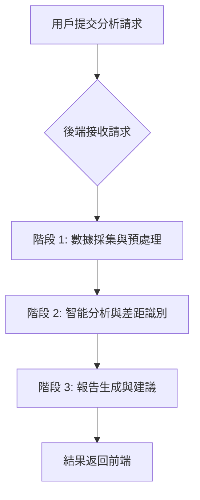

# 內容差距分析器工作流程詳解

本文件詳細闡述了 `content-gap-analyzer` 專案的核心工作流程，旨在幫助用戶理解其網頁內容為何未能被 Google AI Overview 收錄，並提供具體、可執行的優化建議。整個流程分為三個主要階段，每個階段包含多個步驟，確保數據的全面性、分析的深度以及報告的實用性。

## 整體流程概覽

## 詳細工作流程步驟 (Phases)

### 階段 1: 數據採集與預處理 (Data Collection & Pre-processing)

此階段的目標是收集所有必要的原始數據，包括 Google AI Overview 的內容、用戶自身網頁的內容以及相關競爭對手網頁的內容。

*   **步驟 1.1: 獲取 Google AI Overview (SerpAPI)**
    *   **目的**: 獲取目標關鍵字在 Google 搜尋結果頁 (SERP) 中顯示的 AI Overview 摘要及其引用的來源網址。
    *   **執行組件**: `backend/src/services/serpApiService.ts`
    *   **數據流**:
        1.  `analysisService` 調用 `serpApiService`。
        2.  `serpApiService` 向外部 SerpAPI 發送請求，查詢目標關鍵字。
        3.  SerpAPI 返回包含 AI Overview 文本、引用連結及其他 SERP 數據的 JSON 響應。
        4.  `serpApiService` 處理響應，提取關鍵信息（摘要文本、引用 URL），並返回給 `analysisService`。
    *   **關鍵考量**: 處理 SerpAPI 的配額限制、網絡錯誤及數據質量（例如，AI Overview 文本過短或無引用）。

*   **步驟 1.2: 爬取用戶網頁內容 (Crawl4AI)**
    *   **目的**: 獲取用戶提交的目標網頁的乾淨、可供分析的文本內容。
    *   **執行組件**: `backend/src/services/crawl4aiService.ts`
    *   **數據流**:
        1.  `analysisService` 調用 `crawl4aiService`。
        2.  `crawl4aiService` 向獨立的 Crawl4AI 服務發送請求，指定用戶網頁 URL。
        3.  Crawl4AI 服務使用無頭瀏覽器（如 Playwright）渲染網頁，並提取主要內容（去除導航、廣告等雜訊）。
        4.  Crawl4AI 返回包含乾淨文本、標題結構、元描述等信息的 JSON 響應。
        5.  `analysisService` 接收並儲存用戶網頁的內容。
    *   **關鍵考量**: 確保爬取成功率、處理 JavaScript 渲染內容、提取內容的準確性。若爬取失敗，會使用 URL 作為 Gemini 的 URL Context 功能的備用方案。

*   **步驟 1.3: 爬取競爭對手網頁內容 (Crawl4AI)**
    *   **目的**: 獲取從 AI Overview 引用中提取的以及用戶額外提供的競爭對手網頁的內容，作為內容差距分析的基準。
    *   **執行組件**: `backend/src/services/crawl4aiService.ts`
    *   **數據流**:
        1.  `analysisService` 從 AI Overview 引用和用戶輸入中彙總競爭對手 URL 列表，並進行去重和過濾（排除用戶自身網頁）。
        2.  `analysisService` 調用 `crawl4aiService` 進行批量網頁爬取。
        3.  Crawl4AI 服務並行爬取這些 URL，返回各自的乾淨內容。
        4.  `analysisService` 收集所有成功爬取到的競爭對手內容。
    *   **關鍵考量**: 批量處理效率、錯誤處理（部分爬取失敗）、確保內容的相關性。若批量爬取失敗，會使用 URL 作為 Gemini 的 URL Context 功能的備用方案。

### 階段 2: 智能分析與差距識別 (Intelligent Analysis & Gap Identification)

此階段利用 Google Gemini AI 模型對收集到的所有數據進行深度分析，識別內容差距並生成初步的洞察。

*   **步驟 2.1: Gemini AI 內容差距分析**
    *   **目的**: 綜合 AI Overview、用戶網頁和競爭對手網頁的內容，利用大型語言模型 (LLM) 進行語義分析，識別內容缺失、E-E-A-T 弱點、意圖不匹配等問題。
    *   **執行組件**: `backend/src/services/geminiService.ts`
    *   **數據流**:
        1.  `analysisService` 將所有收集到的數據（目標關鍵字、AI Overview 內容、用戶網頁內容、競爭對手網頁內容）組合成一個結構化的輸入對象。
        2.  `analysisService` 調用 `geminiService`，並傳遞這些數據。
        3.  `geminiService` 使用預定義的、針對內容差距分析優化的提示詞模板（v6.0 ultimate instruction prompt），將數據發送給 Google Gemini API。
        4.  Google Gemini API 處理請求，生成詳細的分析報告，包括策略與計劃、關鍵字意圖、AI Overview 分析、引用來源分析、網站評估等。
        5.  `geminiService` 接收並解析 Gemini 的響應，返回結構化的分析結果給 `analysisService`。
    *   **關鍵考量**: 提示詞工程的精確性、AI 模型響應的穩定性、處理潛在的 API 錯誤。若 AI 分析失敗，會生成一個基礎的備用分析報告。

### 階段 3: 報告生成與建議 (Report Generation & Recommendations)

最後階段是將分析結果整理成一份清晰、可操作的報告，並進行最終的質量評估。

*   **步驟 3.1: 生成詳細分析報告**
    *   **目的**: 將 Gemini AI 生成的原始分析結果與其他元數據（如分析 ID、時間戳、處理步驟狀態）結合，形成最終的、完整的分析報告。
    *   **執行組件**: `backend/src/services/analysisService.ts`
    *   **數據流**:
        1.  `analysisService` 接收到 `geminiService` 返回的分析結果。
        2.  `analysisService` 添加額外的元數據，如分析 ID、時間戳、各處理步驟的狀態、使用的備用數據標誌等。
        3.  將最終報告儲存起來，以便後續查詢。

*   **步驟 3.2: 品質評估與成本優化考量**
    *   **目的**: 評估本次分析的整體質量，並提供成本優化相關的信息。
    *   **執行組件**: `backend/src/services/analysisService.ts`
    *   **數據流**:
        1.  `analysisService` 根據各個處理步驟的完成狀態、競爭對手網頁的成功爬取率等指標，計算一個分析質量分數和評級（例如：excellent, good, fair, poor）。
        2.  這些質量評估信息會包含在最終的分析報告中。
    *   **關鍵考量**: 確保評估指標的客觀性和準確性。

## 關鍵技術棧

*   **後端**: Node.js, TypeScript, Express.js
*   **AI 模型**: Google Gemini API
*   **搜尋數據**: SerpAPI
*   **網頁爬取**: Crawl4AI (Python, Playwright)
*   **數據緩存**: Redis
*   **前端**: React, TypeScript, TanStack Query, Tailwind CSS

## 數據流總結

1.  **用戶請求**: 前端收集用戶輸入（關鍵字、URL），發送 API 請求至後端。
2.  **後端協調**: `analysisController` 接收請求，轉交給 `analysisService`。
3.  **外部數據獲取**: `analysisService` 調用 `serpApiService` (獲取 AI Overview) 和 `crawl4aiService` (爬取網頁內容)。
4.  **AI 分析**: `analysisService` 將所有數據傳遞給 `geminiService`，由其與 Google Gemini API 交互進行核心分析。
5.  **結果回傳**: `geminiService` 返回分析結果給 `analysisService`，後者進行最終整理。
6.  **報告呈現**: `analysisService` 將最終報告返回給 `analysisController`，再由其發送回前端，前端負責渲染展示。

整個流程強調自動化、智能化和可操作性，旨在為用戶提供深入的內容優化洞察。